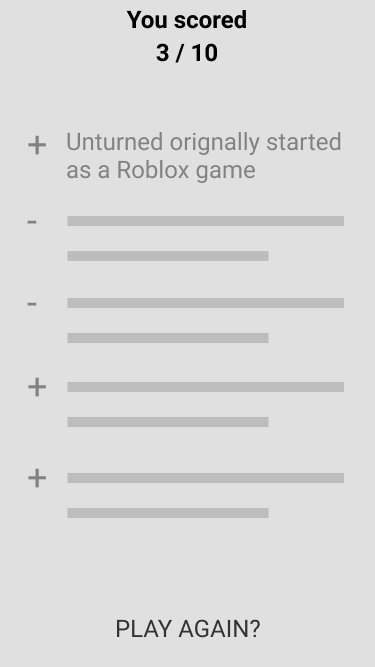

### How to run the app
1. `$ cd Trivialy/`
2. `$ yarn`
3. `react-native run-ios` or `react-native run-android`

note: this app is set up to also use the https://appcenter.ms and so uses Cocoapods - to run the app from Xcode you must open the `.xworkspace` file.

### How the App Works!

Welcome to the Trivia App!

This app was generated using Ignite - a great boilerplate app generator from the folks at Infinite Red, a React Native consultancy. Ignite provides some strong conventions and patterns surrounding data fetching, storage, transforms, and presentation. It make some basic assumptions that can be useful for getting a simple app like this up and running in no time, but still with an eye towards scalability and maintainability.

Ignite's stack includes redux for state management, redux saga for api calls and async side-effects, seamless-immutable and ramda for data persistence and functional paradigm that nicely complements React's data flow. Ignite uses libraries like react-navigation, react-native-vector-icons, react-native-animatable and other standardized best-practice React Native libraries.

The app's entry point is App.js which injects the app with the redux store and middleware, and renders the root container. This component dispatches the "startup" action of the app in it's `componentDidMount` lifecycle method. This "startup" action kicks off the "startUpSaga" wherein we kick off another redux action — `fetchQuizRequest` which kicks off the `getQuizSagas` and loads all the basic data of the app. In this case we only make one API call to load the quiz questions, but in other scenarios we could do many other things here.

When the `fetchQuizRequest`, we flip a flag in our redux state to display an activity indicator to show the user that data is loading. If the API call is a success, we send the data to redux and prepare to transform it for presentation. If the API call fails, we could display an alert, or retry, or something of the sort.

Once the app is loaded, the `LaunchScreen` is shown, and the user is able to begin the quiz. Moving into the `QuizScreen`, this redux-connected smart component is able to determine which quiz question the user is one, and is able to transform the question into a more readable form. The api returns to us html encoded characters, which doesn't look good on mobile, so we need to decode these using a transform in our `mapStateToProps`. 

As the user continues through the quiz, each time they answer a question we merge that answer into the question in its redux state slice. This way we will be able to keep track of their answers and calculate their score later. We also increase the index of the question they are on so that we can update the view with the next question.

After the user answers the last question they are taken to the `ResultsScreen`. Here their answers are calculated, and their score is presented to them along with a list of which questions they answered correctly. We use another transform here to calculate their score from the redux state, and we similarly calculate if they got a question right or wrong with a simple imported function as well. From here the user is able to reset their quiz score, which resets their redux state to unanswered questions and sets their question index back to 0. 

In sum, this app uses redux, redux-saga, react-navigation, apisauce, and ramda to build an efficient, maintainable, scalable, and readable app.


--------------------------------------------------------
original readme:


# Trivia Game Coding Challenge

## Overview

Your challenge is to create a simple, 10 question, true or false, trivia app in the technology you are applying to work in.

**The application code will be reviewed and scored on these key areas with many subset areas for each:**

- Functionality
- Code Format
- Project Structure
- Scalability
- Maintainability
- Use of industry best practices

## Goals

Implement the screens based off the wireframes and api below using advanced techniques and industry best practices for your platform. Note that the wireframes may not be complete, so use your best judgment for UI/UX implementation.

## Specifications

Data:

The api url is: https://opentdb.com/api.php?amount=10&difficulty=hard&type=boolean

Sample returned json:

```javascript
{
  "response_code": 0,
  "results": [
    {
      "category": "Entertainment: Video Games",
      "type": "boolean",
      "difficulty": "hard",
      "question": "Unturned originally started as a Roblox game.",
      "correct_answer": "True",
      "incorrect_answers": [
        "False"
      ]
    },…]}
```

### Intro / Home Screen:


- Static Text
- BEGIN button navigates to the Quiz screen and starts the Quiz

### Quiz Screen:


- The headline is from question category
- The card element contains the current question
- The next question should appear after the current question is answered True or False
- After all questions have been answered, navigate to the Results Screen

### Results screen:



- The Score shows correct and total
- Displays a list of the questions and whether the answer was correct or not
- PLAY AGAIN starts over and navigates to the Home Screen
