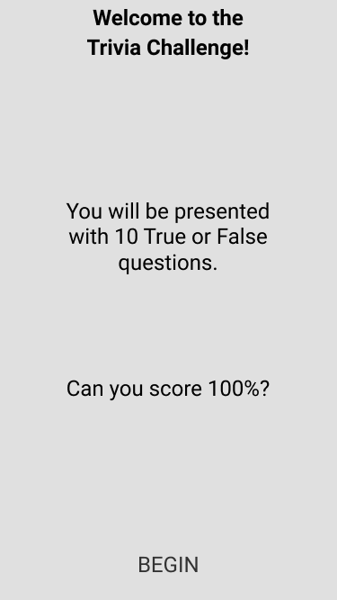

# Trivia Game Coding Challenge

## Overview

Your challenge is to create a simple, 10 question, true or false, trivia app in the technology you are applying to work in.

**The application code will be reviewed and scored on these key areas with many subset areas for each:**

- Functionality
- Code Format
- Project Structure
- Scalability
- Maintainability
- Use of industry best practices

## Goals

Implement the screens based off the wireframes and api below using advanced techniques and industry best practices for your platform. Note that the wireframes may not be complete, so use your best judgment for UI/UX implementation.

## Specifications

Data:

The api url is: https://opentdb.com/api.php?amount=10&difficulty=hard&type=boolean

Sample returned json:

```javascript
{
  "response_code": 0,
  "results": [
    {
      "category": "Entertainment: Video Games",
      "type": "boolean",
      "difficulty": "hard",
      "question": "Unturned originally started as a Roblox game.",
      "correct_answer": "True",
      "incorrect_answers": [
        "False"
      ]
    },…]}
```

### Intro / Home Screen:



- Static Text
- BEGIN button navigates to the Quiz screen and starts the Quiz

### Quiz Screen:


- The headline is from question category
- The card element contains the current question
- The next question should appear after the current question is answered True or False
- After all questions have been answered, navigate to the Results Screen

### Results screen:


- The Score shows correct and total
- Displays a list of the questions and whether the answer was correct or not
- PLAY AGAIN starts over and navigates to the Home Screen
